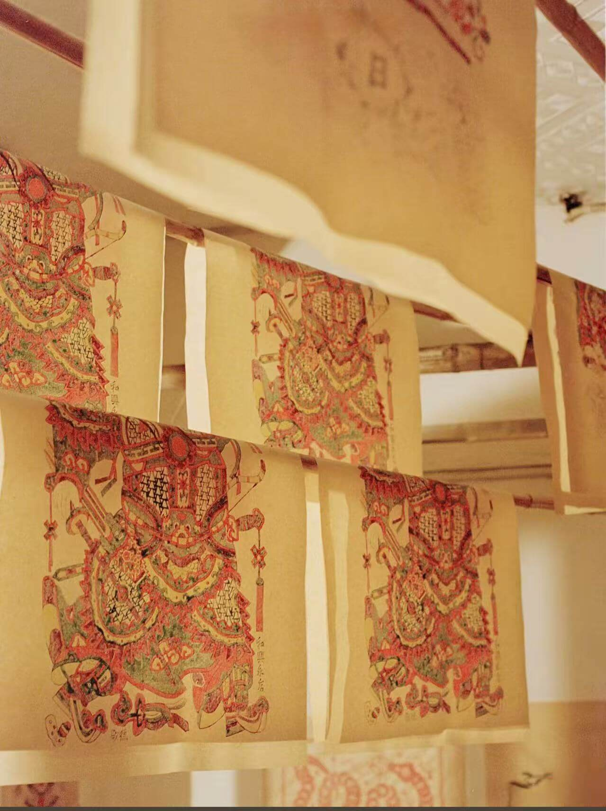

# model-server

面向「年画」相关应用的模型与静态资源服务仓库，主要用于管理并同步小程序端使用的 3D 模型、分层图、知识图文和视频素材。

## 视频展示

- 点击上方预览图可播放/下载视频：[`nianhua-making.mp4`](./public/knowledge/nianhua-making.mp4)

## 主要目录

- `public/model/`：GLB 3D 模型资源
- `public/layers/`：分层图资源
- `public/knowledge/`：知识图文与视频素材
- `api/`：模型生成与资源处理接口

## 部署与同步

静态资源同步说明见：[`README-部署指南.md`](./README-部署指南.md)
