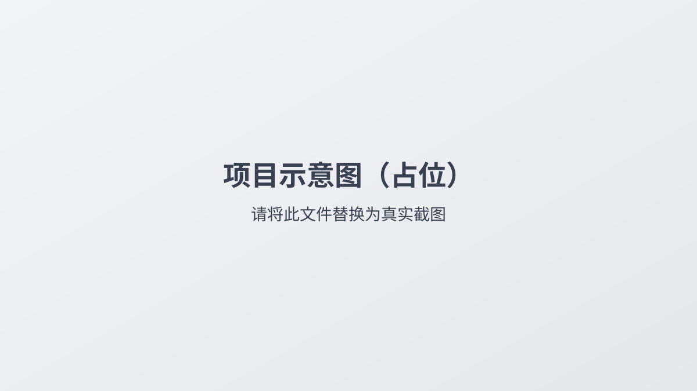

# model-server

`model-server` 是用于承载项目静态资源与模型相关服务的仓库。

## 仓库简介（About 建议填写）

> 这一部分需要在 GitHub 网页端设置，不能通过仓库文件直接修改。

- **Description**：模型与静态资源服务仓库（3D 模型 / 科普素材 / 分层图片）
- **Website**：可填写你的线上访问地址（后续补充）
- **Topics**：`model-server`、`3d`、`wechat-miniprogram`、`cloudbase`、`static-assets`

## 功能说明

- 管理并同步 `public/` 下的静态资源
- 承载 3D 模型资源（如 `public/model/`）
- 承载知识科普图片/视频资源（如 `public/knowledge/`）
- 承载首页与展厅分层图资源（如 `public/layers/`）

## 快速开始

1. 克隆仓库并进入目录
2. 将模型/图片/视频素材放入 `public/` 对应子目录
3. 推送到 `main` 后，GitHub Actions 会按仓库配置同步静态资源

更多部署和同步细节请查看：[`README-部署指南.md`](./README-部署指南.md)

## 目录结构

```text
model-server/
├── api/                 # 接口相关代码
├── public/
│   ├── model/           # GLB 3D 模型
│   ├── knowledge/       # 科普图片与视频
│   └── layers/          # 分层图资源
└── README-部署指南.md
```

## 图片展示（示例）

将图片放到仓库后，按相对路径引用：



> 提示：如图片路径暂未创建，先按你的实际路径替换即可。

## 视频介绍（后续补充）

视频上传后，把链接替换到下面：

[](https://your-video-hosting-site.com/your-video)

> 提示：推荐用封面图 + 外链视频的方式，仓库首页展示更稳定。

## 联系方式

- 维护者：项目团队（可替换为你的名称）
- 问题反馈：请提交 GitHub Issue
